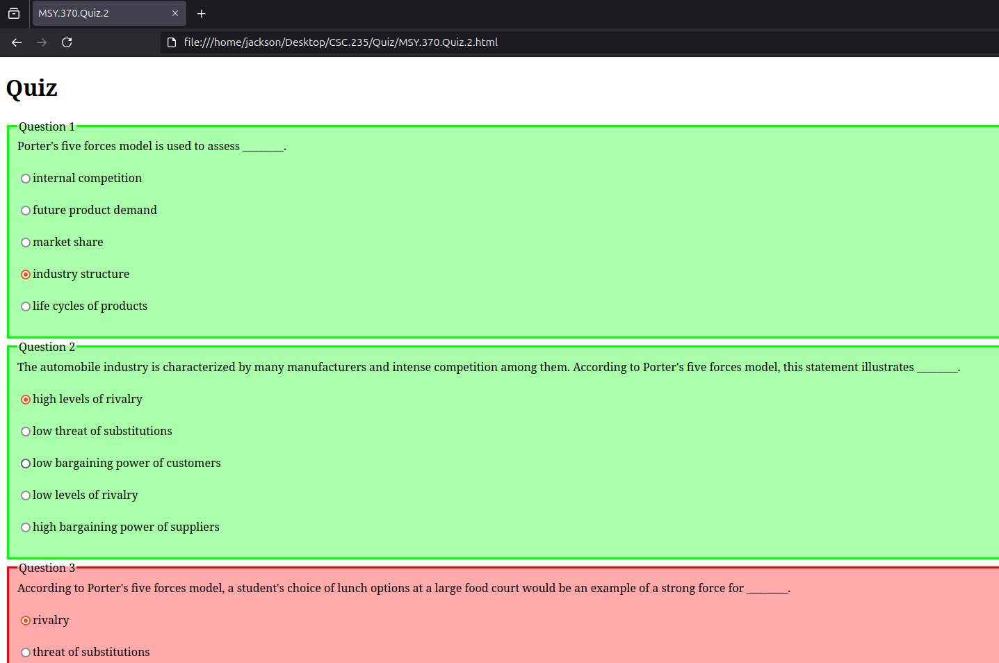

# bash-html-quiz-generator

<!-- TABLE OF CONTENTS -->

<summary>Table of Contents</summary>
<ol>
  <li>
    <a href="#about-the-project">About The Project</a>
  </li>
  <li>
    <a href="#getting-started">Getting Started</a>
  </li>
  <li><a href="#usage">Usage</a></li>
</ol>


<!-- ABOUT THE PROJECT -->
## About The Project



This project is a currently a bash script used to convert a text file into an html quiz to prepare for blackboard test based off of quizes.  I took mostly the javascript and a little html from a comment that i am having trouble finding.


<!-- GETTING STARTED -->
## Getting Started

In order to use this script you need to generate a text file that is delimited by colons.  the first value indicates what kind of line it is and the second contains it's value.  The table below specifies the kind of lines. [Example](Sample.Input.Files/ECO.101.Quiz.2.txt).

|Value|Description|
|:---|:---|
| q | This means that the line is a question |
| i | This is an image and it will create the necessary img tag |
| l | This is used if the question has more than one line, perhaps split by an image |
| w | This is an answer choice that is incorrect |
| x | This is an answer that is correct, because the website uses radio buttons only one choice should be correct |

<!-- USAGE EXAMPLES -->
## Usage

The below command will grab all of the issue links in order.

  ```sh
  ./generate.sh -i ECO.101.Quiz.2.txt -o ECO.101.Quiz.2.html
  ```
